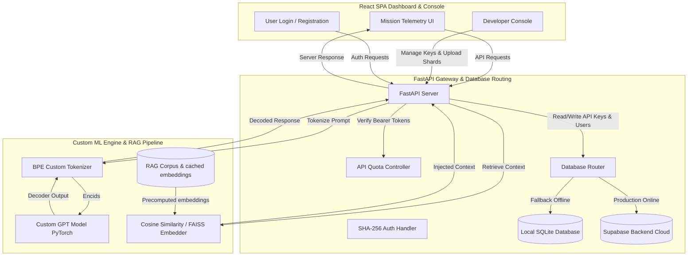

# ASTRA (Advanced Space Telemetry & Retrieval Agent)


ASTRA is a complete, custom end-to-end artificial intelligence ecosystem designed for orbital command and mission telemetry centers. It combines a state-of-the-art causal **Decoder-Only Transformer (GPT)** trained from scratch on custom datasets with a **Retrieval-Augmented Generation (RAG)** context pipeline, a secure **Developer API Gateway** with quota-limiting logic, and a premium, responsive **React Single Page Application (SPA)** dashboard designed with high-fidelity telemetry metrics, real-time Earth trajectory visualizations, and vitals monitoring.

---

## 🌌 System Architecture

The ASTRA architecture is composed of three primary pillars operating in synchrony:



---

## 📂 Directory Map & File Registry

The repository is organized into modular subsystems. Below is a detailed description of each component:

```
ASTRA/
├── api/                    # Backend API Gateway & Database Interface
│   ├── database.py         # Dual-engine SQLite & Supabase handler with SHA-256 hashing
│   └── server.py           # FastAPI application serving SPA routes & Developer endpoints
├── model/                  # Deep Learning Neural Network Core (Decoder-Only GPT)
│   ├── attention.py        # Multi-Head Causal Self-Attention Layer
│   ├── config.py           # Model Hyperparameter Configuration class
│   ├── gpt.py              # Core PyTorch GPT network & Transformer blocks
│   └── transformer_block.py# Standard Transformer layers with residual LayerNorms
├── training/               # ML Model Training & Tokenization pipelines
│   ├── dataset.py          # PyTorch dataset loader with stride configurations
│   └── tokenize_data.py    # Raw corpus tokenization script using trained BPE weights
├── tokenizer/              # Custom Byte-Level BPE Tokenizer
│   ├── merges.txt          # Trained subword merges representation
│   ├── train_tokenizer.py  # Script for training BPE tokenizers from raw CSV datasets
│   └── vocab.json          # Vocabulary lookup mapping subwords to unique indices
├── data/                   # Structured Datasets, Databases, and Builders
│   ├── dataset_sources/    # Modular data source scrapers (Alpaca, Kaggle Wikipedia, SQuAD, CSV)
│   ├── build_dataset.py    # Main pipeline runner calling registered datasets
│   ├── dataset_adapter.py  # Unified formatting converters (Plain text / Conversation tags)
│   ├── merge_datasets.py   # Multi-source dataset compiler generating raw corpus text
│   ├── registry.py         # Global dataset source registry decorator
│   ├── tokenized.npy       # Pre-tokenized corpus token array saved as binary numpy format
│   └── users.db            # SQLite local user & developer keys database
├── tools/                  # Utility scripts and supplementary services
│   └── rag.py              # FAISS-based high-performance Vector Indexing utility
├── src/                    # Frontend React Single Page Application (Vite + TSX)
│   ├── components/         # Dashboard views, developer panels, sidebars, and authentication
│   ├── App.tsx             # Central route switcher & session coordinator
│   ├── index.css           # Premium styling tokens & global TailwindCSS directives
│   ├── main.tsx            # React application entrypoint mounting the DOM
│   └── types.ts            # TypeScript interfaces representing system types
├── checkpoints/            # Directory saving trained PyTorch weights (.pt)
├── configs/                # Shared model configurations
├── security_spec.md        # Comprehensive security specification and exploit scenario testing
├── supabase_schema.sql     # SQL migration script for Supabase DB setup
├── requirements.txt        # Python backend dependencies list
├── package.json            # Frontend dependency specifications and dev scripts
└── tsconfig.json           # TypeScript configuration guidelines
```

---

## 🛠️ Subsystem Details

### 1. Neural Network Core & Generation (`model/` & `generate.py`)
The AI core is a custom **Decoder-Only GPT model** constructed in PyTorch:
*   **Layer Norms & Residual Path**: Follows modern Pre-LN transformer structure.
*   **Causal Masking**: Enforces strict autoregressive prediction by masking future tokens in multi-head attention.
*   **Mixed Precision & Scaled Init**: Supports mixed-precision training (`torch.amp.autocast`) with gradient scaling and clip thresholds.
*   **Prompt Formatting**: Prompts are formatted under `<USER>` and `<SYSTEM>` tag wrappers to enable conversational tuning.
*   **RAG Engine**: Prior to feeding tokens into the GPT model, the user query is embedded via `SentenceTransformer("all-MiniLM-L6-v2")`. It retrieves the top $k$ relevant context blocks from `data/raw/corpus.txt` based on cosine similarity, pre-generating local embeddings into `data/raw/corpus_embeddings.npy` to load instantly.

### 2. Backend API Gateway & Database (`api/`)
A high-throughput API gateway written using FastAPI:
*   **Dynamic Auth**: Features registration and login with SHA-256 salted password verification.
*   **Hybrid Database Routing**: Tries to connect to a cloud-based **Supabase** instance. If environment variables are missing, it falls back seamlessly to a local **SQLite** database (`data/users.db`).
*   **Developer API Key Controller**: Developers can register designated keys via the UI dashboard. The API server supports a secure Bearer token endpoint (`/api/v1/context/generate`) that validates tokens, increments request statistics, enforces rate quotas, and supports custom temperatures.

### 3. Frontend Telemetry Dashboard & Developer Console (`src/`)
A premium design theme with dark modes, glowing micro-animations, and glassmorphism elements:
*   **Mission Telemetry Dashboard**: Displays rotating real-time 3D Earth tracking calculations (altitude, velocity) and crew vitals telemetry (heart rate, $O_2$ levels) with custom micro-animations. Contains a fully interactive workspace chat interface.
*   **Hyper-Jump Simulation**: Simulates FTL sequence adjustments, updating telemetry values (velocity scaling to the speed of light) and logging alerts dynamically.
*   **Developer Console**: Allows developers to generate API keys, copy authentication tokens with clipboard feedback, monitor telemetry stats (API requests & memory core usage gauges), and drop custom JSON/CSV/TXT memory shards into the workspace using drag-and-drop file upload progress bars.

---

## 🚀 Installation & Local Launch

### Prerequisites
*   **Node.js** (v18 or higher)
*   **Python** (3.10 or higher with PyTorch environment)

### 1. Backend Setup & Dependency Installation
Create a Python virtual environment and install the required machine learning and server packages:
```bash
# Create and activate virtual environment
python -m venv .venv
.venv\Scripts\activate  # On Windows

# Install Python packages
pip install -r requirements.txt
```

### 2. Environment Configurations
Configure database keys and variables. Duplicate the `.env.example` file to create a `.env.local` configuration:
```bash
copy .env.example .env.local
```
Add your **Gemini API key** and optional **Supabase URL & Key** to connect to cloud hosting:
```env
GEMINI_API_KEY="your-gemini-api-key"
VITE_SUPABASE_URL="https://your-supabase-project.supabase.co"
VITE_SUPABASE_ANON_KEY="your-supabase-anon-key"
```

### 3. Training & Precomputing Tokenizers (Optional)
If you wish to retrain or generate tokenizer mappings and tokenized arrays:
```bash
# Process raw text source documents and merge databases
python data/merge_datasets.py

# Train custom BPE Tokenizer weights
python tokenizer/train_tokenizer.py

# Tokenize data
python training/tokenize_data.py

# Run a sample epoch of GPT training
python train.py
```

### 4. Running the Complete System
Launch the development servers:

#### Start the React Frontend Developer Server:
```bash
npm install
npm run dev
```

#### Start the FastAPI Server:
```bash
python api/server.py
```
By default, the server binds to `http://localhost:3000`. The frontend will automatically map endpoints to the backend port.

---

## 🔒 Security Specifications

The system implements strict database constraints detailed in `security_spec.md`:
1.  **User Isolation**: Cross-tenant data leaks are prevented via strict row-level filters. Users can only query documents or metrics belonging to their authenticated session identifier.
2.  **Quota Poisoning Guards**: Restricts developer key creation, updating, or request increases to prevent denial of wallet/storage exhaust attacks. Length properties on uploaded document IDs are constrained to alphanumerics (`^[a-zA-Z0-9_\-]+$`) with defined payload limits.
3.  **Exploit Scenario Verification**: Covers verification of 12 distinct exploit payloads (including unauthorized cross-tenant writes, shadow-field modifications, schema expansion bypasses, and numeric score injections).
