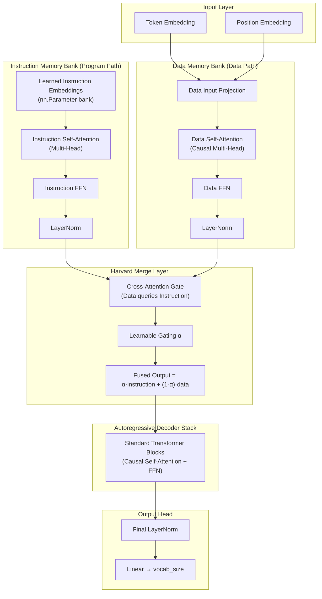

# ASTRA (Advanced Space Telemetry & Retrieval Agent)

ASTRA is a custom end-to-end artificial intelligence engine designed for orbital command and mission telemetry processing. At its core is a state-of-the-art **Harvard Dual-Memory Transformer** trained from scratch in PyTorch, integrated with a **Retrieval-Augmented Generation (RAG)** pipeline and a custom Byte-Level Byte Pair Encoding (BPE) Tokenizer.

The neural architecture is inspired by the Harvard CPU design — it maintains separate instruction and data processing paths that converge via cross-attention gating before autoregressive generation.

---

## 🌌 Core ML Architecture

ASTRA's model is a custom **Harvard Dual-Memory Transformer** constructed in PyTorch. Unlike standard decoder-only models, it separates general instruction patterns from transient prompt context:



### Subsystem Details

1. **Instruction Memory Bank**: A learned parameter bank (`nn.Parameter`) of shape `(n_inst, n_embd)` representing instructions, syntax rules, and task prompts. It processes these embeddings through a multi-head self-attention layer to create a structured "program ROM."
2. **Data Memory Path**: Projects input tokens and positional embeddings through causal self-attention, functioning as the transient context/data bus.
3. **Harvard Merge Layer**: Merges the two paths using cross-attention where the data path queries the instruction bank. A learnable gating scalar $\alpha$ blends the representations: $\text{output} = \alpha \cdot \text{instruction} + (1 - \alpha) \cdot \text{data}$.
4. **Decoder Stack**: Autoregressive transformer blocks with Pre-LN residual connections.
5. **RAG Pipeline**: Leverages `SentenceTransformer("all-MiniLM-L6-v2")` to retrieve the top $k$ relevant context blocks from a local corpus (`data/raw/corpus.txt`), pre-generating and caching embeddings in `data/raw/corpus_embeddings.npy` to load instantly.

---

## 📂 Repository Structure

The clean, modular ML repository is organized as follows:

```
ASTRA/
├── model/                  # Deep Learning Neural Network Core
│   ├── attention.py        # Multi-Head Causal Self-Attention Layer
│   ├── config.py           # Model Hyperparameter Configuration class
│   ├── gpt.py              # Legacy Decoder-Only GPT network (reference)
│   ├── harvard.py          # Harvard Dual-Memory Architecture
│   └── transformer_block.py# Standard Transformer layers with residual LayerNorms
├── training/               # ML Model Training & Tokenization pipelines
│   ├── dataset.py          # PyTorch dataset loader with stride configurations
│   └── tokenize_data.py    # Raw corpus tokenization script
├── tokenizer/              # Custom Byte-Level BPE Tokenizer
│   ├── merges.txt          # Trained subword merges representation
│   ├── train_tokenizer.py  # Script for training BPE tokenizers
│   └── vocab.json          # Vocabulary lookup mapping
├── data/                   # Structured Datasets and builders
│   ├── dataset_sources/    # Modular data source scrapers
│   ├── build_dataset.py    # Main pipeline runner calling registered datasets
│   ├── dataset_adapter.py  # Unified formatting converters
│   ├── merge_datasets.py   # Multi-source dataset compiler
│   ├── registry.py         # Global dataset source registry
│   ├── tokenized.npy       # Pre-tokenized corpus token array (binary numpy format)
│   └── raw/                # Raw text source files (corpus.txt)
├── tools/                  # Utility scripts
│   └── rag.py              # FAISS-based high-performance Vector Indexing utility
├── checkpoints/            # Directory saving trained PyTorch weights (.pt)
├── configs/                # Shared model configurations
├── requirements.txt        # Python ML dependencies list
└── README.md               # System documentation
```

---

## 🛠️ Installation & Local Launch

### Prerequisites
- **Python 3.10+** (with PyTorch support)
- NVIDIA GPU (Optional, CUDA supported)

### 1. Install Dependencies
Set up your virtual environment and install the required machine learning dependencies:
```bash
# Create and activate virtual environment
python -m venv .venv
.venv\Scripts\activate  # On Windows
# source .venv/bin/activate  # On Linux/macOS

# Install packages
pip install -r requirements.txt
```

### 2. Prepare Data & Precompute Embeddings
Generate the consolidated corpus and compile BPE weights:
```bash
# 1. Process raw data sources and compile into corpus.txt
python data/merge_datasets.py

# 2. Train custom Byte-Level BPE Tokenizer
python tokenizer/train_tokenizer.py

# 3. Pre-tokenize the compiled text corpus
python training/tokenize_data.py
```

### 3. Model Training
Run the training loop to train the Harvard Dual-Memory Transformer:
```bash
python train.py
```
This saves per-epoch checkpoints (`checkpoints/harvard_model_epoch{N}.pt`) and the final model weight weights to `checkpoints/harvard_model.pt`.

### 4. Interactive Generation (CLI)
Interact with the trained Harvard model with built-in retrieval-augmented generation (RAG):
```bash
python generate.py
```
On first run, this script precomputes and caches RAG embeddings to `data/raw/corpus_embeddings.npy` for subsequent zero-latency loading.
